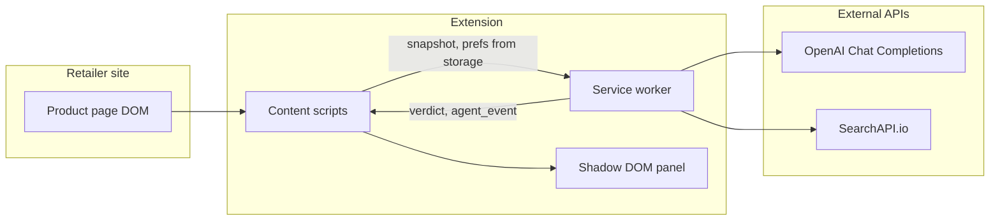
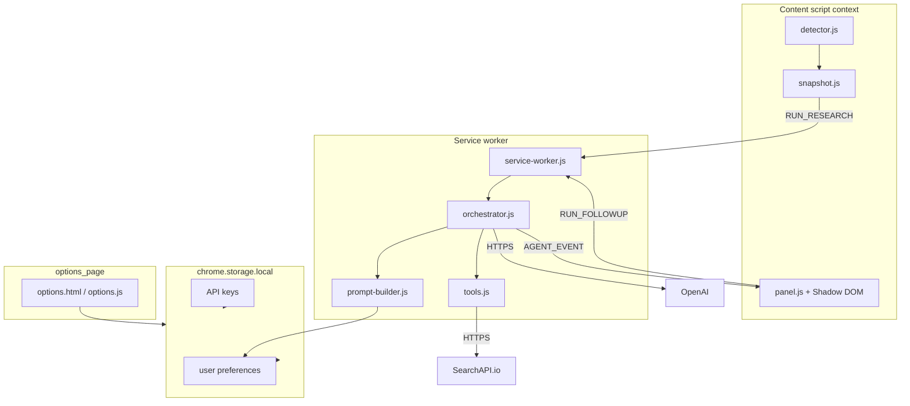

# Shopping Research Agent — Architecture

This document explains how the Chrome MV3 extension is structured, how data flows between layers, and how the agent loop is organized. It complements the implementation in this folder: `manifest.json`, `background/`, `content/`, `options/`, and `shared/`.

## System context

## Layered responsibilities

| Layer | Responsibility |
|--------|----------------|
| **Content scripts** | Detect Amazon/Flipkart PDPs, build a compact DOM snapshot, render the injected Shadow DOM panel (phase strip, agent activity, trust banner, verdict, follow-up). |
| **Service worker (background)** | Hold API keys and preferences from `chrome.storage.local`, run the OpenAI tool loop and synthesis step, call SearchAPI.io (Google engine) from tool handlers, emit `AGENT_EVENT` messages to the tab for the timeline UI. |
| **Options page** | Persist OpenAI key, SearchAPI.io key, budget/region/priorities, research mode, and agent-activity detail level. |
| **Shared** | `schemas.js` defines the structured verdict JSON schema (`response_format: json_schema`) and a small clamp helper so snippet-based telemetry can only make `price_signal_quality` more conservative, not stronger. |

## Component diagram

## Agent pipeline (service worker)

1. **Prompt assembly** — `prompt-builder.js` combines a fixed system policy (no false price precision, respect prefs) with shopping preferences (budget band, region, priorities, avoid list) and a research-mode hint (quick vs deep, mapped to max tool turns in `orchestrator.js`).
2. **Research phase** — Repeated `chat/completions` calls with `tools`. The model emits `tool_calls`; the worker executes `web_search`, `price_deal_signal`, `find_alternatives`, or `open_retailer_search`, appends `tool` role messages, derives optional **`price_signal_quality` telemetry** from `price_deal_signal` results, and emits timeline events (`tool_start`, `tool_end`, `synthesis_*`, `error`).
3. **Synthesis phase** — When the model stops requesting tools (or the turn budget is exhausted), a final `chat/completions` call runs **without** tools and with **`response_format: json_schema`** matching `verdictJsonSchema()` in `shared/schemas.js`. Parsed JSON is optionally **clamped** against telemetry so weak snippet evidence cannot be upgraded to a “strong” price signal.

## Trust and explainability hooks

- **Structured verdict** — Single schema for `verdict`, `confidence`, `price_signal_quality`, `summary`, lists, alternatives, and citations; suitable for UI binding and audit.
- **Trust banner** — The panel reads `price_signal_quality` from the verdict JSON (`weak` / `moderate` / `strong`) and shows copy that matches the plan: snippet-based limits, no implied live charts.
- **Agent activity stream** — The service worker does not stream tokens; it streams **discrete events** (tool name, argument preview, duration, summarized result) so users can explain *what ran* without exposing chain-of-thought.

## File map

| Path | Role |
|------|------|
| `manifest.json` | MV3 manifest, permissions, service worker module, content scripts, web-accessible `panel.css`. |
| `background/service-worker.js` | Message routing: `RUN_RESEARCH`, `RUN_FOLLOWUP`. |
| `background/orchestrator.js` | OpenAI loop, tool execution, synthesis, `agent_event` emission. |
| `background/prompt-builder.js` | System prompt + formatted user snapshot message. |
| `background/tools.js` | SearchAPI.io Google search + `open_retailer_search` URL builder. |
| `content/detector.js` | PDP detection for Amazon/Flipkart. |
| `content/snapshot.js` | Title/price/URL snapshot (no full HTML). |
| `content/panel.js` | Shadow UI, phase strip, timeline, verdict, follow-up. |
| `content/panel.css` | Panel styles (loaded inside Shadow root). |
| `options/options.html` | Keys and preferences form. |
| `shared/schemas.js` | Verdict JSON schema + clamp helper. |

## Security notes

- Secrets live only in `chrome.storage.local` on the client; they are never embedded in the repository.
- Host permissions are limited to OpenAI and SearchAPI.io (`https://www.searchapi.io/*`) used by the worker.
